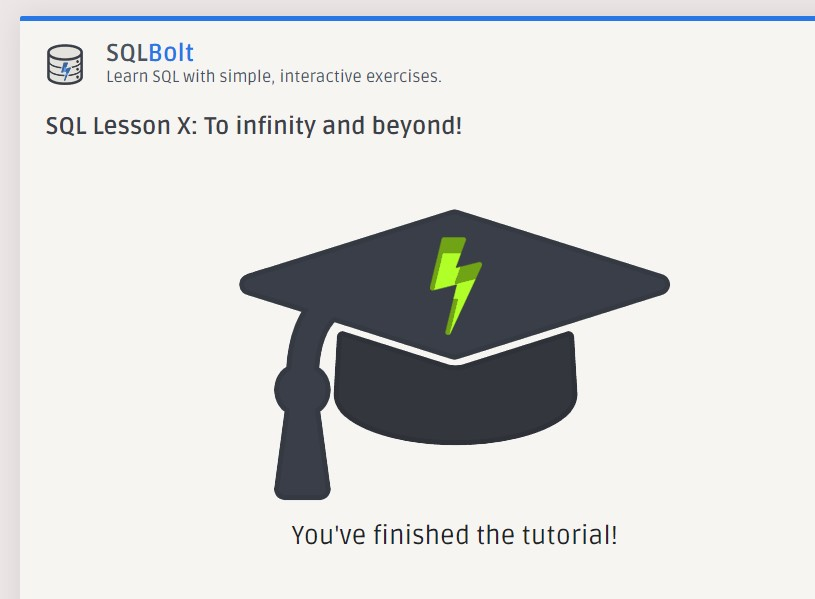
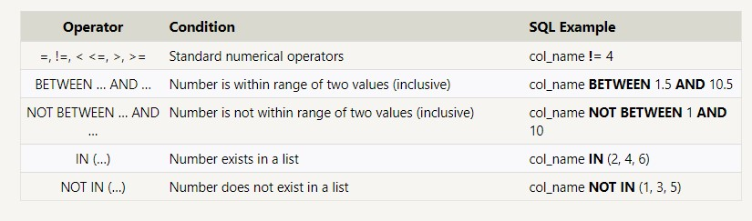
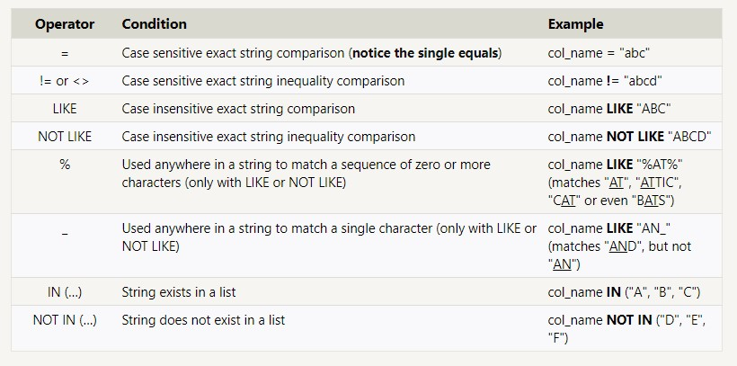
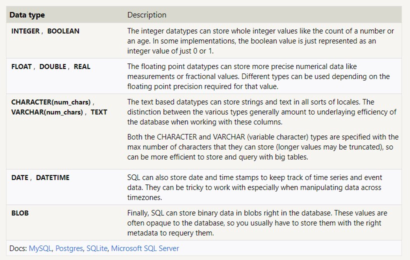
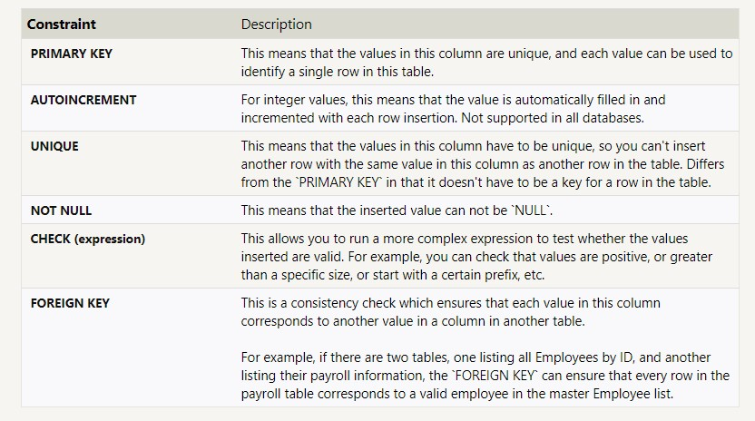

# SQL - Sequential Query Language

***[Cheatsheet](http://www.cheat-sheets.org/sites/sql.su/)***

## SQL BOLT

Lessons 1- 4 were one SELECT querys with conditions using WHERE and ORDER BY.  

`SELECT * FROM mytable;`

`SELECT column, another_column, …`
`FROM mytable;`

`SELECT column, another_column, …`
`FROM mytable`
`WHERE condition`
    `AND/OR another_condition`
    `AND/OR …;`

`SELECT column, another_column, …`
`FROM mytable`
`WHERE condition`
    `AND/OR another_condition`
    `AND/OR …;`

`SELECT DISTINCT column, another_column, …`
`FROM mytable`
`WHERE condition(s);`

`SELECT column, another_column, …`
`FROM mytable`
`WHERE condition(s)`
`ORDER BY column ASC/DESC;`

`SELECT column, another_column, …`
`FROM mytable`
`WHERE condition(s)`
`ORDER BY column ASC/DESC`
`LIMIT num_limit OFFSET num_offset;`

Lessons 13 - 18 were on ALTER and UPDATE Tables and columns

#### INSERT
`INSERT INTO mytable`
`(column, another_column, …)`
`VALUES (value_or_expr, another_value_or_expr, …),`
     ` (value_or_expr_2, another_value_or_expr_2, …),`
     ` …;`

`INSERT INTO boxoffice`
`(movie_id, rating, sales_in_millions)`
`VALUES (1, 9.9, 283742034 / 1000000);`

#### UPDATE

`UPDATE mytable`
`SET column = value_or_expr, `
    `other_column = another_value_or_expr, `
   ` …`
`WHERE condition;`

#### DELETE

`DELETE FROM mytable WHERE condition;`

#### CREATE

`CREATE TABLE IF NOT EXISTS mytable (`
    `column DataType TableConstraint DEFAULT default_value,`
    `another_column DataType TableConstraint DEFAULT ``default_value,`
    …
);

Data Types

Table Constraints

##### ALTER ADD

`ALTER TABLE mytable`
`ADD column DataType OptionalTableConstraint `
    `DEFAULT default_value;`

##### ALTER DROP

`ALTER TABLE mytable`
`DROP column_to_be_deleted;`

##### ALTER RENAME

`ALTER TABLE mytable`
`RENAME TO new_table_name;`

##### DROP TABLE

`DROP TABLE IF EXISTS mytable;`

#### [W3SCHOOLS TESTING DB](https://www.w3schools.com/sql/trysql.asp?filename=trysql_select_all)

