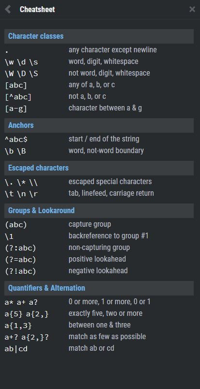

## READING

#### [CSS GRID GARDEN](https://cssgridgarden.com/)

now these are games that I can get into - learning as you go!  Kind of like leapfrog.com

### RegExr

> A regular expression [shortened as regex or regexp;[1] also referred to as rational expression](2)[3] is a sequence of characters that define a search pattern. Usually such patterns are used by string-searching algorithms for "find" or "find and replace" operations on strings, or for input validation. It is a technique developed in theoretical computer science and formal language theory. [reference](https://en.wikipedia.org/wiki/Regular_expression)

### Regex Tutorial
> One of the most interesting features is that once you’ve learned the syntax, you can actually use this tool in (almost) all programming languages ​​(JavaScript, Java, VB, C #, C / C++, Python, Perl, Ruby, Delphi, R, Tcl, and many others) with the slightest distinctions about the support of the most advanced features and syntax versions supported by the engines). [reference](https://medium.com/factory-mind/regex-tutorial-a-simple-cheatsheet-by-examples-649dc1c3f285)

#### Summary
- As you’ve seen, the application fields of regex can be multiple and I’m sure that you’ve recognized at least one of these tasks among those seen in your developer career, here a quick list:
- data validation (for example check if a time string i well-formed)
- data scraping (especially web scraping, find all pages that contain a certain set of words eventually in a specific order)
- data wrangling (transform data from “raw” to another format)
string parsing (for example catch all URL GET parameters, capture text inside a set of parenthesis)
- string replacement (for example, even during a code session using a common IDE to translate a Java or C# class in the respective JSON object — replace “;” with “,” make it lowercase, avoid type declaration, etc.)
- syntax highlightning, file renaming, packet sniffing and many other applications involving strings (where data need not be textual)

*Have fun and do not forget to recommend the article if you liked it* [reference](https://medium.com/factory-mind/regex-tutorial-a-simple-cheatsheet-by-examples-649dc1c3f285)

### [Best Cheatsheets for Grid CSS](https://css-tricks.com/snippets/css/complete-guide-grid/)

I loved playing the GRID GARDEN and wondering the real world application of grids.  Gaming?  Can't wait to hear about it.

## [Responsive Design with CSS Grid](https://medium.com/samsung-internet-dev/common-responsive-layouts-with-css-grid-and-some-without-245a862f48df)

95.38% from [canisue.com](https://medium.com/samsung-internet-dev/common-responsive-layouts-with-css-grid-and-some-without-245a862f48df)

#### Grid and flexbox
> The basic difference between CSS Grid Layout and CSS Flexbox Layout is that flexbox was designed for layout in one dimension - either a row or a column. Grid was designed for two-dimensional layout - rows, and columns at the same time. [reference](https://developer.mozilla.org/en-US/docs/Web/CSS/CSS_Grid_Layout/Relationship_of_Grid_Layout#:~:text=Grid%20and%20flexbox,columns%20at%20the%20same%20time.)

[go back](../README.md)