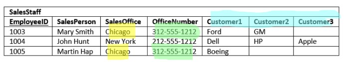

# [Database Normalization](https://www.essentialsql.com/get-ready-to-learn-sql-database-normalization-explained-in-simple-english/)

> Database normalization is a process used to organize a database into tables and columns.  The main idea with this is that a table should be about a specific topic and only supporting topics included.

- By limiting a table to one purpose you reduce the number of duplicate data contained within your database.

**EXAMPLE**

1. Identify the organization's salespeople
1. listing the sales offices and phone numbers
1. association a salesperson with a sales office
1. showing each salesperson's customers

## There are three normal forms most databases adhere to using.

1. Minimize Duplicate Data
1. Minimise or avoid data modifications issues
1. Simplify Queries

## Duplication and modification Anomalies

In the above table there is duplicate informaion which presents 2 issues

1. Increased storage and decrease performance
1. It becomes more difficult to maintain data changes

### Insert Anomaly

Data that is not complete to insert into a Row in a Table

### Update Anomaly

If the office number changes there would be many rows to change

### Deletion Anomaly

Deletion of a sales person would also delete the customer and office infrmation

### Search and Sort Issues

If you wanted to search for FORD - you would have to look in Customer1, Customer 2, and Customer 3, having the customers in their own Table makes things easier.

## Definition of Database Normalization

3 Common forms of DB Normalization

1. 1st or 1 NF
1. 2nd or 2 NF
1. 3rd or 3 NF

***There is also an advance form - BCNF***

> The forms are progressive, meaning that to qualify for 3rd normal form a table must first satisfy the rules for 2nd normal form, and 2nd normal form must adhere to those for 1st normal form. 

***First Normal Form*** - The information is stored in a relational table with each column containing atomic values. There are no repeating groups of columns.

***Second Normal Form*** - The table is in first normal form and all the columns depend on the table's primary key

***Third Normal Form*** - The table is in second normal from and all of it's columns are not transitively dependent on the primary key
