# EJS - Getting started with EJS

## [EJS - Videos - Walkthrough code - John](https://www.youtube.com/watch?v=IqpfBGsALqc&list=PL7sCSgsRZ-slYARh3YJIqPGZqtGVqZRGt)

Easy way to do this is DB config

[Getting Started](https://www.youtube.com/watch?v=63IurQvsw9w&list=PL7sCSgsRZ-slYARh3YJIqPGZqtGVqZRGt&index=2)

`npm init -y`

`npm install --save express body-parser cors ejs`

Make your calls to make things required for server.js to work.

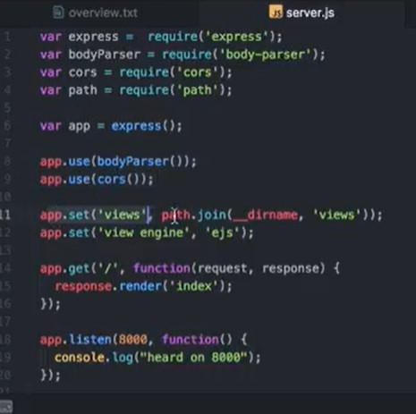

Evidently 'bodyParser' has ben deprecated - trying to work through the solution so code is not working!  

## Variable 
Injecting a Value into EJS

Add variable to index.js using the  `<%= VARIABLE %>`

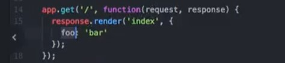
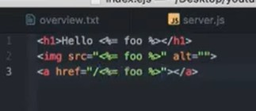
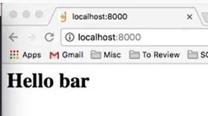

## Arrays

Using an Array of people with EJS

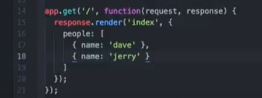

## If .. Else statments

When in you use an 'if..else' statments

whtin the index.js

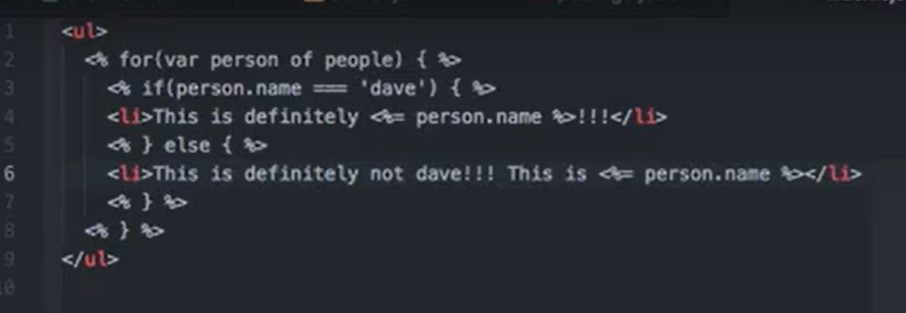
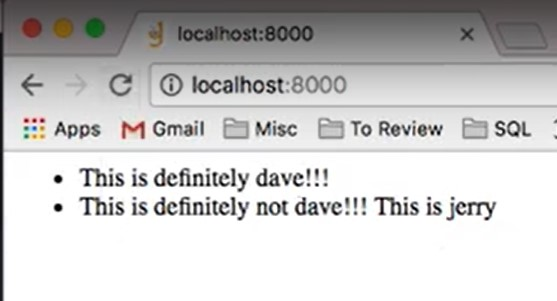

Vast and useful things you can do with EJS

## Layouts 

`views/about.ejs`
`views/layout.ejs`

To install layouts

`npm install --save express-ejs-layouts`

This will install the package that allows you to use layouts.

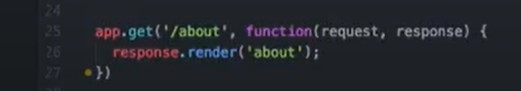
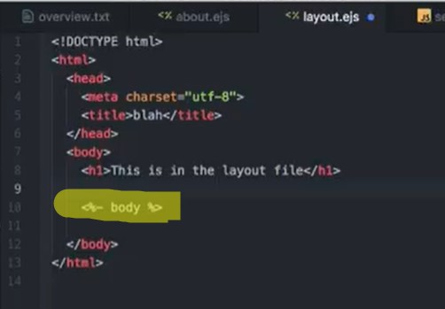
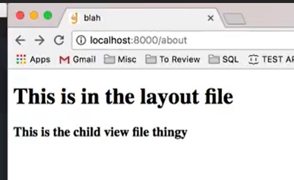

## Partials

Not sure what is going on here with partials - need to investigate it more

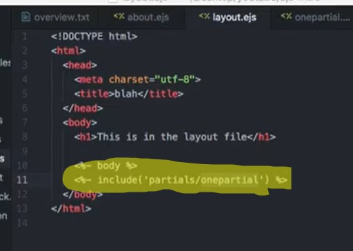
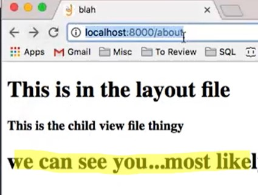

OMG - This guy uses music in his Videos - Need to watch to completion! LOL

[Node.js Express EJS Layouts and Partials Tutorial](https://www.youtube.com/watch?v=lYVKbAn5Od0)