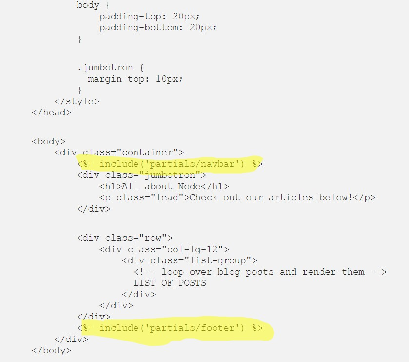
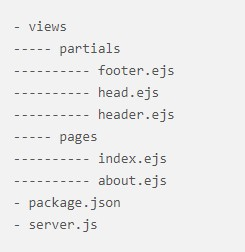

# [EJS Partials](https://medium.com/@henslejoseph/ejs-partials-f6f102cb7433)

Partials come in handy when you want to reuse the same HTML across multiple views. Think of partials as functions, they make large websites easier to maintain as you don’t have to go and change a piece of text in every page it appears in.

***Instead, you define that reusable bundle of code in a file andinclude it wherever you need it.***

- When you look at a web page and see the same navigation and footer, that is where partials are perfect

- view/partials/ footer.ejs and navbar.ejs

> Now that we have our partials defined, we can use them in our home.ejs and post.ejs templates! In EJS, any JavaScript or non-HTML syntax you include in your templates is always surrounded by <% %> delimiters (you could change these delimiters if you really wanted to).
Including a partial in EJS is quite straightforward. You use <%- include( PARTIAL_FILE ) %> where the partial file is relative to the template you use it in.

# More Info and References

## [How To Use EJS to Template Your Node Application](https://www.digitalocean.com/community/tutorials/how-to-use-ejs-to-template-your-node-application)

