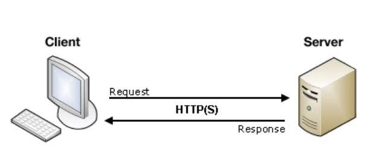
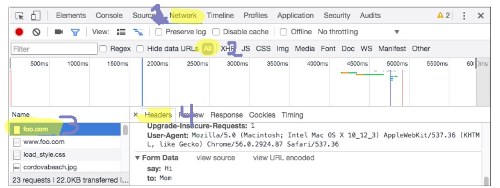

# [Sending Form Data](https://developer.mozilla.org/en-US/docs/Learn/Forms/Sending_and_retrieving_form_data)

## Client/Server Architecture

>At it's most basic, the web uses a client/server architecture that can be summarized as follows. a client (usually a web browser) sends a request to a server (most of the time a web server like Apache, Nginx, IIS, Tomcat, etc.), using the HTTP protocol. The server answers the request using the same protocol.[reference](https://developer.mozilla.org/en-US/docs/Learn/Forms/Sending_and_retrieving_form_data)

### Request and Response

The FORM!
Action - Method

**Action** attribute defines where the data gets sent.

**Method** attribute defines how data is sent.

> "To understand the difference between those two methods, let's step back and examine how HTTP works. Each time you want to reach a resource on the Web, the browser sends a request to a URL. An HTTP request consists of two parts: a header that contains a set of global metadata about the browser's capabilities, and a body that can contain information necessary for the server to process the specific request." [reference](https://developer.mozilla.org/en-US/docs/Learn/Forms/Sending_and_retrieving_form_data)

### The GET method

> The GET method is the method used by the browser to ask the server to send back a given resource: "Hey server, I want to get this resource." In this case, the browser sends an empty body. Because the body is empty, if a form is sent using this method the data sent to the server is appended to the URL.

### The POST method

> The POST method is a little different. It's the method the browser uses to talk to the server when asking for a response that takes into account the data provided in the body of the HTTP request: "Hey server, take a look at this data and send me back an appropriate result." If a form is sent using this method, the data is appended to the body of the HTTP request.

**Viewing HTTP requests**

1. Open the Developer Tools
1. Select Network
1. Select "All"
1. Select "foo.com" in the "Name" tab
1. Select "Headers"

## Response

- **RAW PHP**

- **Python**

- **Other Languages and frameworks**

## Sending Files

> Sending files with HTML forms is a special case. Files are binary data — or considered as such — whereas all other data is text data. Because HTTP is a text protocol, there are special requirements for handling binary data.

If you want to send files, you need to take three extra steps:

1. Set the method attribute to POST.
1. set the value to enctype to multipart/form-data
1. include one or more `<input type = "file">`

## Security Issues

> Each time you send data to a server, you need to consider security. HTML forms are by far the most common server attack vectors (places where attacks can occur). The problems never come from the HTML forms themselves — they come from how the server handles data.

**All data that comes to your server must be checked and sanitized. Always. No EXCEPTION!**

1. Escape potentially dangerous characters
1. limit the incoming amount of data to allow only what's necessary
1. Sandbox uploaded files

> You should avoid many/most problems if you follow these three rules, but it's always a good idea to get a security review performed by a competent third party. Don't assume that you've seen all the possible problems.

