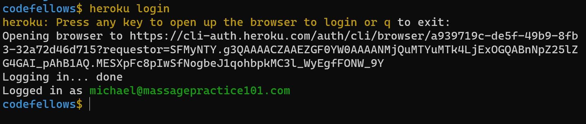
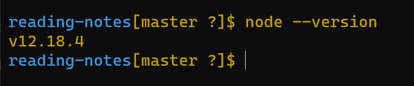
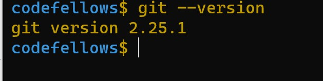
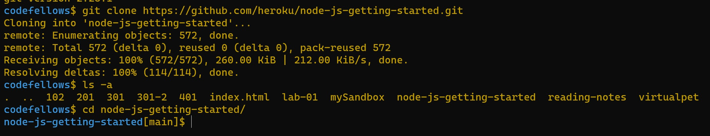
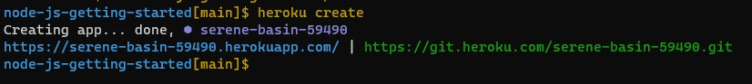
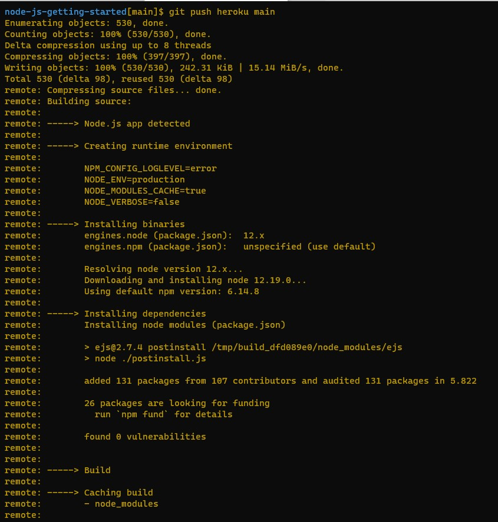
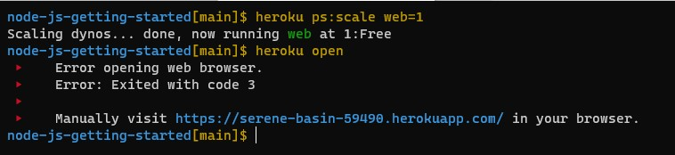
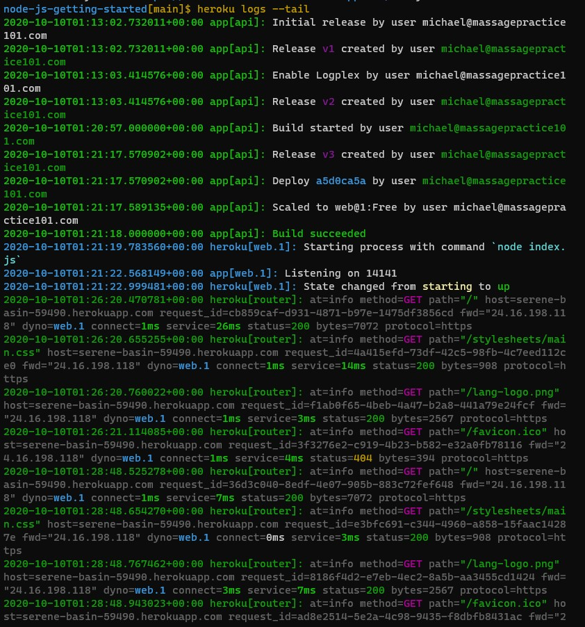

# HEROKU

## Reading
Reading
- Heroku: Getting Started with Node
  - Complete all of the steps through “View logs”

Bookmark/Skim
- Deploying a Simple Blog to Heroku

### Heroku Setup

#### What is Heroku?

Heroku is a cloud platform as a service supporting several programming languages. One of the first cloud platforms, Heroku has been in development since June 2007, when it supported only the Ruby programming language, but now supports Java, Node.js, Scala, Clojure, Python, PHP, and Go. [Wikipedia](https://en.wikipedia.org/wiki/Heroku)

I'm suprised the parent company is Salesforce.com.  Salesforce purchase December 2010. Salesforce purchased many 

> [Heroku: Getting Started with Node](https://devcenter.heroku.com/articles/getting-started-with-nodejs#introduction)

- Complete all of the steps through “View logs”

Of course the first question I had was is NODE.JS the same thing as NODE.  Naming conventions are hard to understand. But Yes - here's the [explanation](https://stackoverflow.com/questions/5621812/why-is-node-js-named-node-js)

## Setup of Heroku

It looks like we have already installed Heroku.  

Logging in takes you to a website to log in.  

Node Version is already installed as well.

Git version is already installed

Getting started with an app.

Create a heroku app from the prepared one downloaded.

Pushed Heroku Main 

Run the App

View Logs:

Installtion Complete!

## Bookmark and Skim

### Deploy your Blog to Heroku

How to setup a [server.js](https://howtonode.org/deploy-blog-to-heroku)

