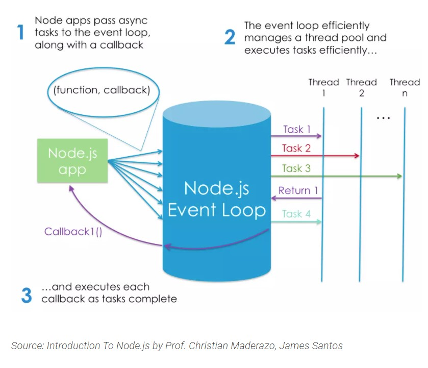

# NODE.JS Reading

[Sitepoint - Node.js](https://www.sitepoint.com/an-introduction-to-node-js/)

## What is Node

Online Definitions: 

> Node.js is a Javascript runtime build on Chrome's V8 JavaScript Engine

> Node.js is an event-based, non-blocking, asyncrhonous I/O runtime that uses Googles's V8 JavaScript engine and 'libuv' library.

### Node is built on Google V8 Engine

'are we talking cars of coding?'

- The V8 engine is an open-source JavaScript engine that runs in Google Chrome and other "Chromium-based" web browser.

- Node was created by [Ryan Dahl](https://tinyclouds.org/)

>Synchronous You want a pizza for dinner and you are out of the frozen kind. So you have to stop playing WOW which upsets your guild. You go to the kitchen, make the dough, cover it with sauce, add the cheese, and smother it your favorite bacon topping. You just spent 20 minutes of your time making the pizza with another 10 minutes in the oven. The timer beeps and you pull the hot pie out. You can sit back down in front of your computer, eat the pizza, and continue with your raid.

> Asynchronous You want a pizza for dinner while playing WOW. You open up a browser window on your 5th monitor. You load up the Pizza website and order your extra cheesy bacon pizza with a side of bacon grease garlic sauce. You go back to your raid and after 20 minutes the door bell rings. You get the pizza. You sit back down in front of your computer, eat the pizza, and continue with your raid.

> So what is the difference? One way you waste 20-30 minutes of precious WOW time, the other way you waste $20 plus tip.
[reference](https://stackoverflow.com/questions/4559032/easy-to-understand-definition-of-asynchronous-event)

Node.js is not run within a browser, but Dahl took the V8 engine and enhanced it with
  - Various Features
  - File Systems
  - API
  - HTTP library
  - Number of operating systems
  - Related utility methods

### Node Binaries vs Version Manager

There are various advantages to using a version manasger. For example, it negates potential permission issues when using Nde with npm and lets you set a Node version on a per-project basis.

### 'Hello World' the Node.js way

[Super Resourse - Compatibility table](https://node.green/)

## When should I use it

