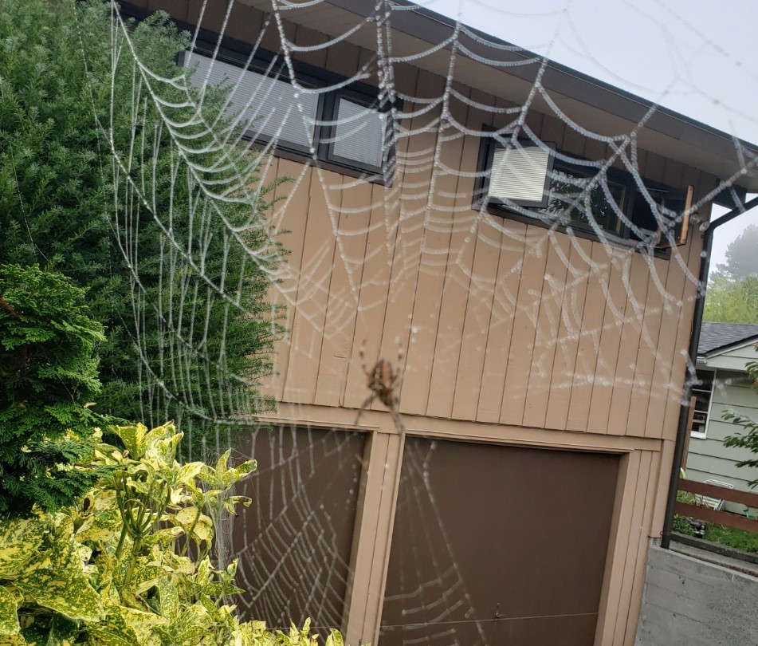
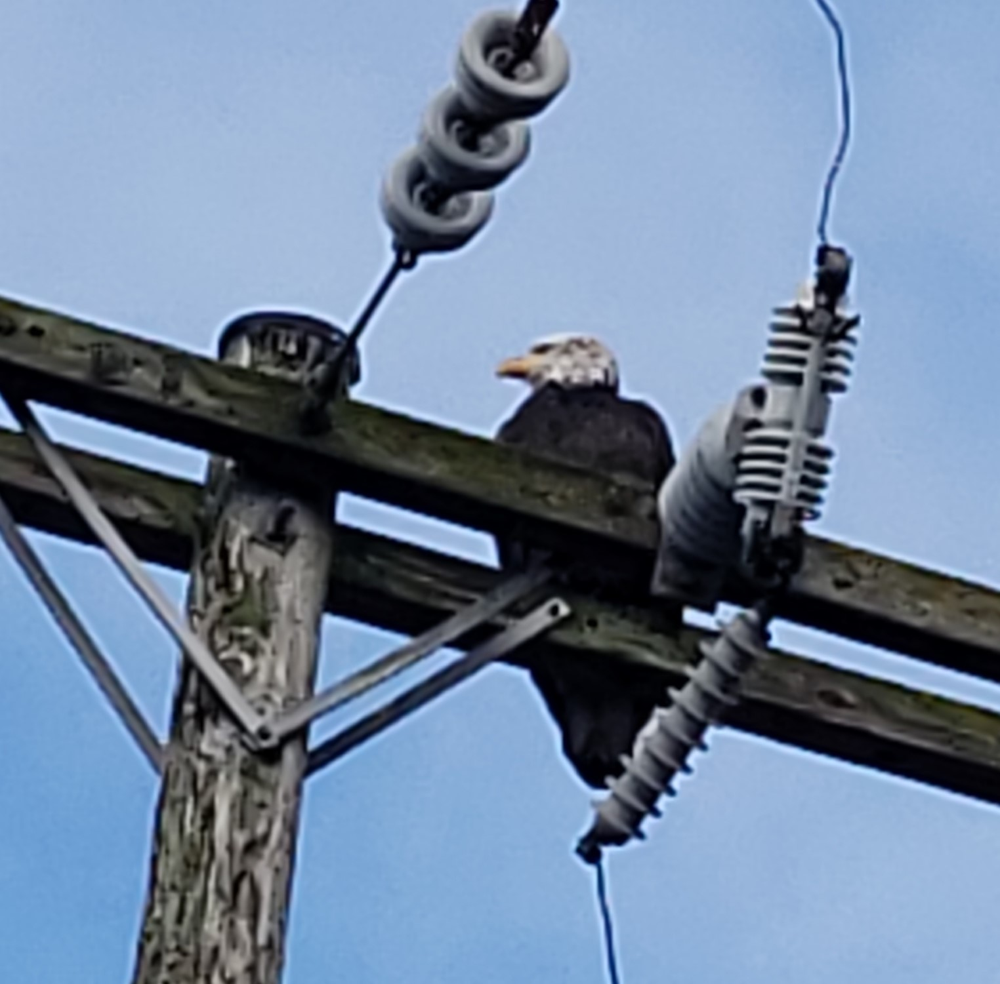

# The Call Stack

#### [JavaScript error reference](https://developer.mozilla.org/en-US/docs/Web/JavaScript/Reference/Errors)
## [The call stack defined - MDM](https://developer.mozilla.org/en-US/docs/Glossary/Call_stack)

> "A call stack is a mechanism for an interpreter (like JavaScript interpreter in a web browser) to keep track of it's place in a script that calls multiple funciotns - what function is currently being run and what functions are called from within that function, etc."(MDM)

- When a script calls a function the interpreter adds it to the call stack and then starts carrying out the funciton

- Any functions that are called by theat function are added to the call stack further up, and run where their calls are reached.

- When the curent function is finished, the interpreter takes it off the stack and resumes execution where it left off in the last code listing.

- if the stack takes up more space than it had assigned to it, it results in a "stack overflow" error.

## [The JavaScript Call STack](https://www.freecodecamp.org/news/understanding-the-javascript-call-stack-861e41ae61d4/)

> "The JavaScript engine (which is found in a hosting environment like the browser), is a single -threaded interpreter comprising of a heap and single call stack. The browser provides web API's like the DOM, AJAX and Timers." (freecodecamp.org - Charles Freeborn)

- Call Stack
- Function Invocation
- Asynchronous Programming

### What is the Call Stack?

> "At the most basic level, a call stack is a data structure that uses the LAST IN, FIRST OUT (LIFO) principle to temporarily store and manage function invocation(call.)" (freecodecamp.org)

**LIFO**

the Last Function that gets pushed into the stack is the first to be pop out, when the function returns.

**Synchonous**

> "think of yourself standing in queue, in a grocery store cash point.  You can only be attended to after the person in front of you has been attended to."

This is what happens when the code is run:

1. When secondFunction() gets executed, an empty stack frame is created. It is the main (anonymous) entry point of the program.
1. secondFunction() then calls firstFunction()which is pushed into the stack.
1. firstFunction() returns and prints “Hello from firstFunction” to the console.
1. firstFunction() is pop off the stack.
1. The execution order then move to secondFunction().
1. secondFunction() returns and print “The end from secondFunction” to the console.
1. secondFunction() is pop off the stack, clearing the memory.

**What causes a stack overflow?**

***Recursive Function*** a function that calls itself without an exit point.

**Key Takeaways**

1. It is single-threded, meaning it can only do one thing at a time.
1. Code execution is synchronous.
1. A function invocation creates a stack fram that occupies a temporary memory.
1. It works as a LIFO.

## [JavaScript error messages && debugging](https://codeburst.io/javascript-error-messages-debugging-d23f84f0ae7c)

(ref: Codeburst.io - Diogo Sphinola)

> "Most of your time as a developer is spent reading code followed by debugging that same code, most likely to be able to read it or solve an “unexpected feature” (which, joking aside, is more correctly known as a “bug”)." (codeburst.io)

### Types of error messages

1. Reference Errors - check!
1. Syntax Errors - Check!
1. Range Errors - Check!
1. Type Errors - Check!

check - I've had everyone one so far!

### Debugging

- Console.log
- Debugger
- breakpoints

### Call Stack

- Testing is Automatically called since it's an IIFE
- Obj Variable is declared with the funciton add
- The function add is called from the Obj Variable with two strings has parameters.
- The function add is called again, this time with number, the values are added making it 3 but then, split is called which makes an error being thrown.

### Handling Errors

> "An alternative it’s to encapsulate our problematic function code with a try…catch which would make an error be thrown but this time, not “uncaught” so we can send it to a error logging to be checked later and send a fallback to the function so that our code continues without problems."

### Tools to avoid runtime errors

- quokka
- eslint
- Typescript

> "Being able to read error messages and practising debugging is one of your biggest weapons has a developer, do it frequently and with enough time you will notice a great decrease in the time you spend on each error that you find along the way. And remember, before a commit/push, remove all the debugging stuff from your code, we don’t want the client or another developer to get stuck on a debugger now do we?"(codeburst.io)

##########################

