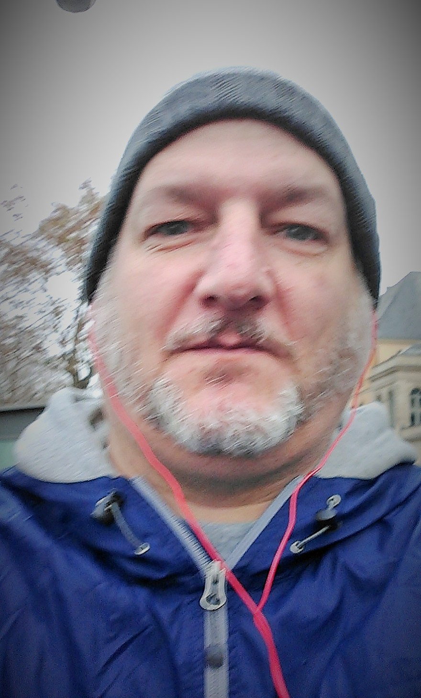
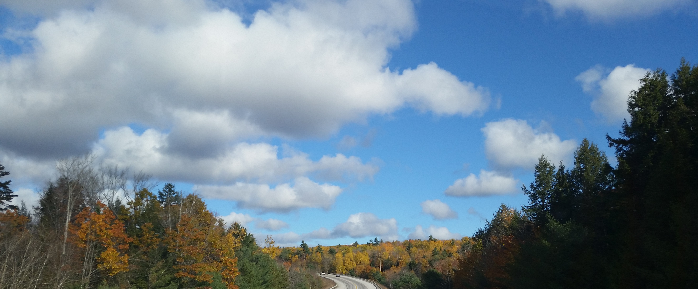

# Code 201 Reading Notes

 Github is [Michael Mandell](https://github.com/DaddyBearSEA)  

This is the reading notes site of Michael Mandell, Student at Code Fellows. This is where I will be putting my notes from the reading assignments.  I have also included some quick links for class and favorite sites for syntax

### Other Links
[Slack](https://app.slack.com/client/T039KG69K/D01419MJVAB/thread/C039KG6A1-1591124619.046600) ||  [Canvas](https://canvas.instructure.com/) ||
[FrontRow](https://frontrowviews.com/Home/Event/ProviderDetails/5a83c3f209310b1d68d45c46) || 
[Git Syntax](git.md) || [Markdown Syntax](https://www.markdownguide.org/cheat-sheet/) || [Ubuntu Cmds](https://medium.com/@vanshvarshney_/20-basic-ubuntu-commands-and-terminal-shortcuts-every-beginner-must-know-92c131fb4c2c)

###### ** Maine Foliage October 2008 **

## Table of Contents  
  
##### not all links work yet!

- [Class 1 - July 6, 2020](class-01.md) 
- [Day 2 - July 7, 2020](7jul2020.md)
- [day 3 - July 8, 2020](8jul2020.md)
- [day 4 - july 9, 2020](9july2020.md)
- [day 5 - july 10, 2020](10jul2020.md)
- [day 6 - july 13, 2020](13jul2020.md)
- [day 7 - july 14, 2020](14jul2020.md)
- [day 8 - july 15, 2020](15jul2020.md)
- [day 9 - july 16, 2020](16jul2020.md)
- [day 10 - july 17, 2020](17jul2020.md)
- [day 11 - july 18, 2020](28jul2020.md)
- [day 12 - july 19, 2020](19jul2020.md)
- [day 13 - july 20, 2020](20jul2020.md)
- [day 14 - july 21, 2020](21jul2020.md)
- [day 15 - july 22, 2020](22jul2020.md)

| Work in Progress 	|  Seven Pillars of Career Coaching	| 
|-	|-	|
| 201-Class Project TBD	|  1. Professional Etiquette	|  
| 102- [Class HTML/CSS/JS Project](https://daddybearsea.github.io/class-project/)  	| 2. Professional Pitch 	| 
|  	| 3. Createing a Network	|
|  	| 4. Job Search Readiness 	|
|  	| 5. Targeted Job Search	|
|  	| 6. Professional Materials 	|
|  	| 7. Beahvioral Interview Questions	|

###### ***NOTE: All pictures used are from my own camera. Samsung Galaxy S7J or S9. Berlin, Seattle, and Calgary. I'm a foody! so drinks and food are my jam!***