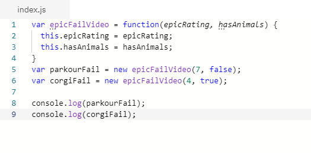
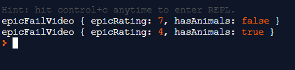

# Readings : Object-Oriented Programming, HTML Tables

## Read
[Domain Modeling](https://github.com/codefellows/domain_modeling#domain-modeling)

**Object Oriented Model** is where an entity stores data in properties and encapulates behaviors in method.

### Console.log

## Why didn't we have this chapter to read for Monday AM??? 
Ok - randomNumbers

`EpicFailVideo.prototype.generateRandom = function(min, max) {`
  
  `return Math.floor(Math.random() * (max - min + 1)) + min;`
`}`

Here's some tips to follow when building your own domain models.

1. When modeling a single entity that'll have many instances, build self-contained objects with the same attributes and behaviors.
1. Model its attributes with a constructor function that defines and initializes properties.
1. Model its behaviors with small methods that focus on doing one job well.
1. Create instances using the new keyword followed by a call to a constructor function.
1. Store the newly created object in a variable so you can access its properties and methods from outside.
1. Use the this variable within methods so you can access the object's properties and methods from inside.

#### From the Duckett HTML book:

## Chapter 6: “Tables” (pp.126-145)

Tables - Think Word Tables
- `<table>` element is used to add table to a aweb page
- a talbe is drawn out row by row. Each row is create with the `<tr></tr>` element of the `<th></th>`
= inside each row there are a number of cells represented by the `<td></td>` element or `<th></th>` if it is a header
- you can make cells of a table span more than one row or column using the rowspan and colspan attributes **This is just like Excel Spreadsheets**
- for long tables you can split the table into a `<thead><tbody>` and `<tfoot>`

#### NOTE: table width, spacing, border and background are now controlled in the CSS.

#### From the Duckett JS Book:

## Chapter 3: “Functions, Methods, and Objects” (pp.106-144)

### an object is a series of variables and functions that represent something from the world around you
- the new keyword and the object constructor create a blank object `var hotel = new Object();`
- you can add properties
- you can add methods (functions ) `hotel.checkAvailability = function() { code}`

### in an object, varaiables are known as properties of the object; functions are known as methods of the object;

### web browsers implement objects that represent both the browser window and the document loaded into the browser window

**Three groups of Built-in Objects
1. Browser Object Model - creates a model of the browser tab or window `window.print();`
1. document object model(DOM) - creates a model of the current web page `document.getElementById('one');`
1. Global Javascript Objects - a group of individual object that relate to different pats of the JavaScrip language `hotel.toUpperCase();`

### Javascript also has serveral buil-in objects such as String, Number, Math and Date  their propertis and methods offer funcitonality that help you write scripts

### Arrays and objects can be used to create complex data sets (and both can contain the other )

I really need to go back and study this chapter closer - so much really good indo and code / methods / etc