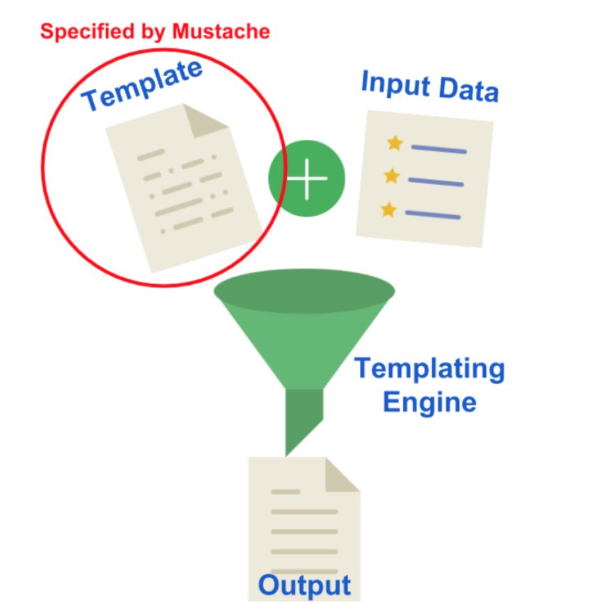
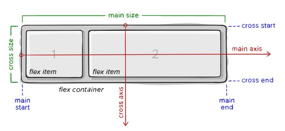
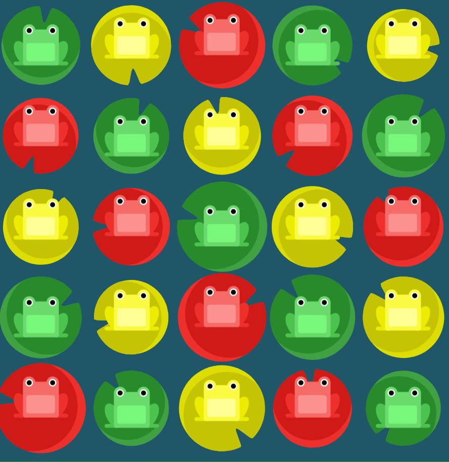

## Reading
### [Templating with Mustache](https://medium.com/@1sherlynn/javascript-templating-language-and-engine-mustache-js-with-node-and-express-f4c2530e73b2)

**Javascript Templating**
> ' Javascript templating is a fast and efficient technique to render client-side view templates with Javascript by using a JSON data source. The template is HTML markup, with added templating tags that will either insert variables or run programming logic.' [referecne](https://medium.com/@1sherlynn/javascript-templating-language-and-engine-mustache-js-with-node-and-express-f4c2530e73b2)

> "Mustache is a logic-less template syntax. It can be used for HTML, config files, source code — anything. It works by expanding tags in a template using values provided in a hash or object."

`Mustache.render(“Hello, {{name}}”, { name: “Sherlynn” });`
this will display "Hello, Sherlynn"

###  [A Guide to Flexbox](https://css-tricks.com/snippets/css/a-guide-to-flexbox/)

Since flexbox is a whole module and not a single property, it involves a lot of things including its whole set of properties. Some of them are meant to be set on the container (parent element, known as “flex container”) whereas the others are meant to be set on the children (said “flex items”). [reference](https://css-tricks.com/snippets/css/a-guide-to-flexbox/)

- main axis
- main-start | mina-end
- main size
- cross axis
- cross start | corss-end
- cross size

[Flexbox in 1/2 Hour](https://www.youtube.com/watch?v=k32voqQhODc&t=207s) 
"Learnwebcode"

#### Properties of the Parent
- Display
- Flex-Direction
  - row 
  - row-reverse
  - column
  - column-reverse
- flex wrap
  - nowrap
  - wrap
  - wrap-reverse

- flex flow
- justify content
  - flex-start
  - flex-end
  - center
  - space-between
  - space-around
  - space-evenly
  - align-items
  - align-content

  #### Properties of the Child
 - order
 - flex-grow
 - flex-shrink
 - flex-basis
 - flex
 - align-self
 
 Great Reference - [Flex box Cheatsheet](https://yoksel.github.io/flex-cheatsheet/)

### [Flexbox Froggy](https://flexboxfroggy.com/)
> Complete all steps of this tutorial

OMG  I LOVED THIS EXERCISE:  
I got stuck on a FEW but then the LAST ONE - 
googled it and the anwers are out in [Github!](https://gist.github.com/lukasrudnik/c72cafebd0db5bae4aa5563b24e73fd2)
Which is a very good reverence now!  

????  WHY ????? Question 24

` #pond {`
  `display: flex;`
`flex-flow:column-reverse wrap-reverse;`
`justify-content:center;`
`align-content:space-between;`
`}`

### Bookmark/Skim

### Reference: [Mustache.js Official Documentation](https://github.com/janl/mustache.js)

