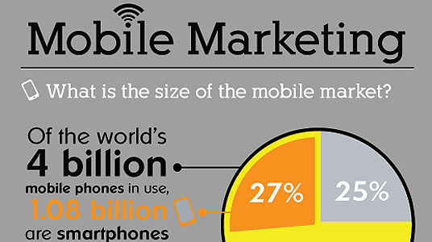

# Responsive Web Design

## Reading

#### Shay Howe’s intro to RWD

Design for Mobile devices.  

 - Desktop computer and cell phone users alike all benefit from responsive websites.
 - Responsive vs. Adaptive vs. Mobile
    - Responsive generally means to react quickly and positively to any change,
    - adaptive means to be easily modified for a new purpose or situation, such as change. 
    - Mobile generally means to build a separate website commonly on a new domain solely for mobile users. 
- Flexible Layouts
  3 components
    1. Flexible Layout
    1. Media Queries
    1. Flexible Media

#### Flexible Layouts
> flexible grids

> Dynamically resizing

> Used relative units- em, % 

Relative Viewport Lengths

- vw - Viewport Width
- vmin - Minimum of the viewport's height and width
- vh - Viewport Height
- vmax - Maximum of the viewport’s height and width

**Do not use fixed units like pixels and inches.** The viewport height and width continually change from device to device. 

### All About Floats

## Bookmark/Skim

#### Don’t Overthink It Grids

#### CSS Floats Explained By Riding An Escalator - If you took Code 201, review this article. If you did not take Code 201, this is Essential reading.

#### SMACSS Official Documentation